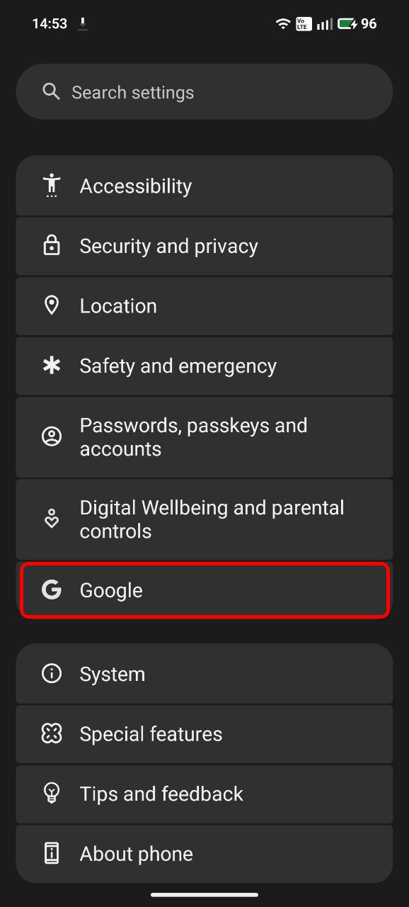
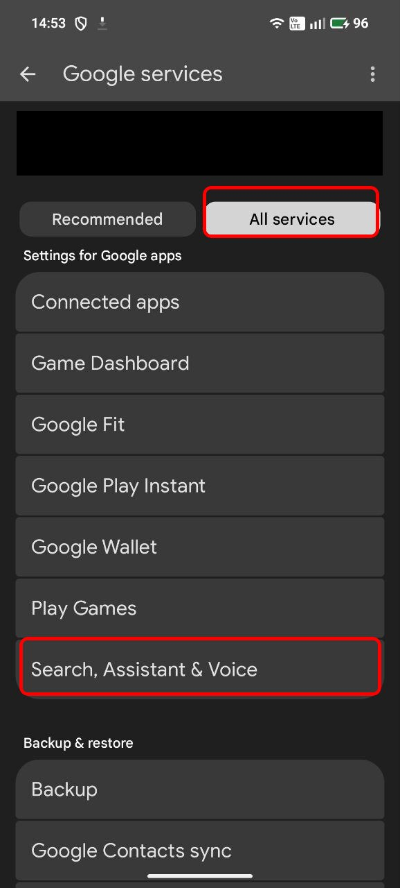
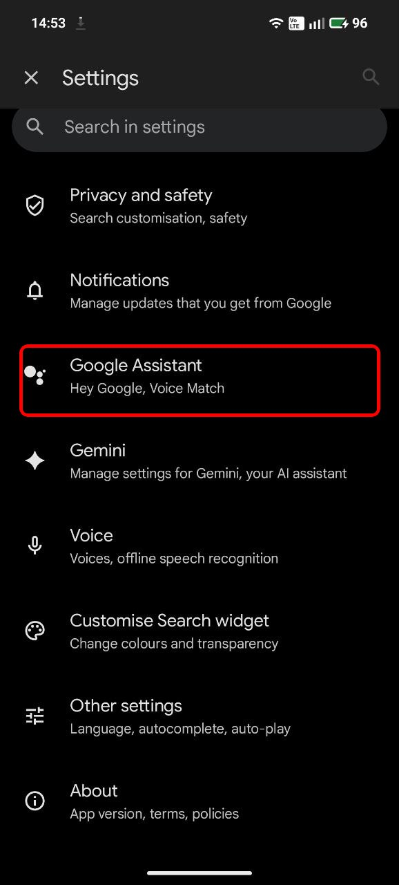
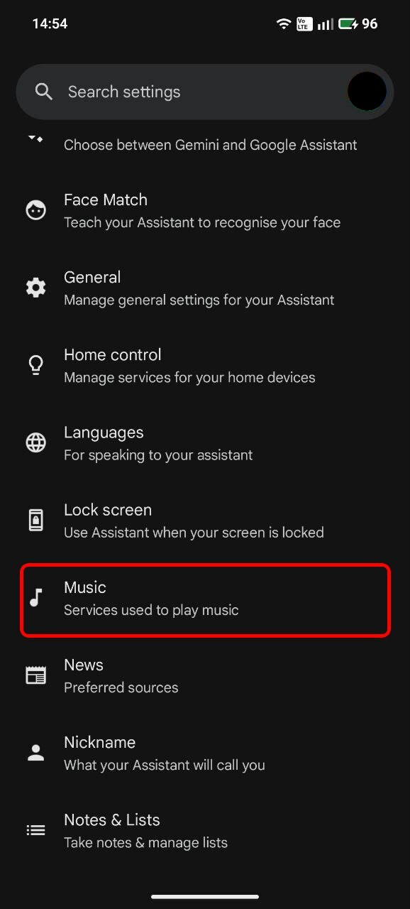
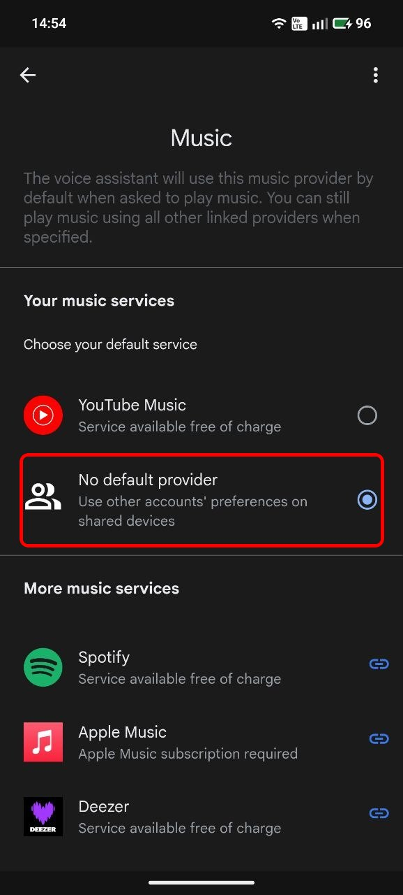
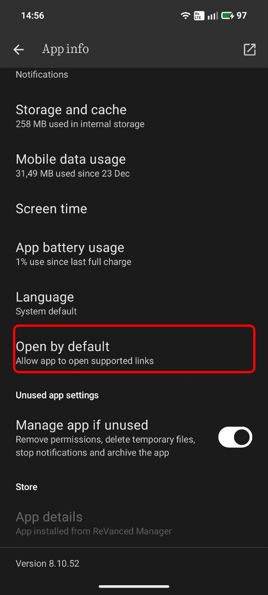
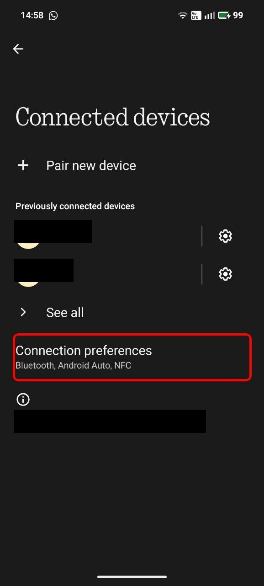
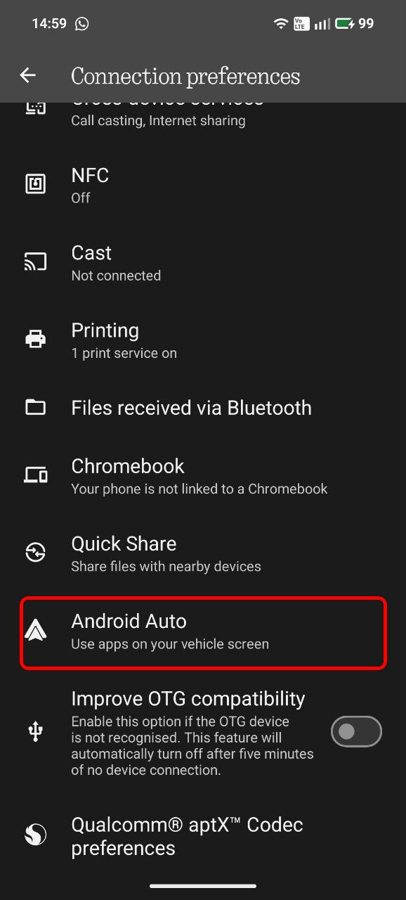
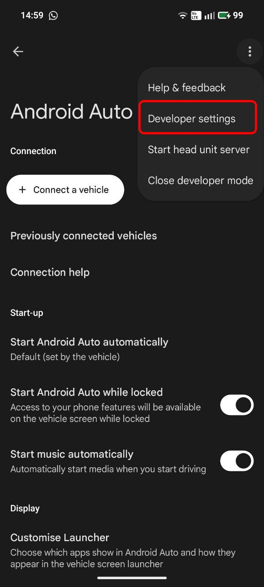
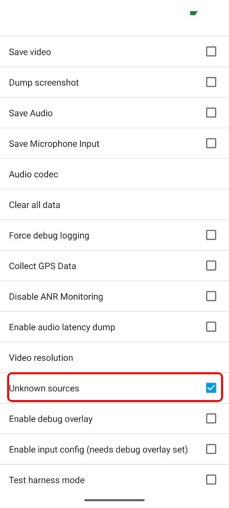

# YouTube Music ReVanced Configuration Guide

This guide explains how to properly configure YouTube Music ReVanced to work with Google Assistant and Android Auto.

> **Why is this needed?**
>
> Without root, ReVanced cannot mount the patched app over the original YouTube Music app. Instead, it must be installed as a separate app with a different package name (e.g., `app.revanced.android.apps.youtube.music` instead of `com.google.android.youtube.music`). Because of this, Google Assistant and Android Auto don't recognize it as the default music player. These configuration steps work around this limitation.
---

## Quick Summary

| Configuration | Path | Action |
|:-------------:|------|--------|
| **Google Assistant** | Settings > Google > All services > Search, Assistant & Voice > Google Assistant > Music | Select **No default provider** |
| **Default Links** | Settings > Apps > YT Music ReVanced > Open by default | Add **music.youtube.com** |
| **Android Auto** | Settings > Connected devices > Connection preferences > Android Auto > Version (tap x10) > ⋮ > Developer settings | Enable **Unknown sources** |

---

## Step-by-Step Guide

<strong>Part 1: Google Assistant Configuration</strong>

 

> Disable the default music provider in Google Assistant to prevent it from opening the official YouTube Music app.

Step 1.1 - Open Google Settings

Go to **Settings** and scroll down to find **Google**.

Step 1.2 - All Services

Select the **All services** tab and then tap **Search, Assistant & Voice**.

Step 1.3 - Google Assistant

Tap **Google Assistant**.

Step 1.4 - Music

Scroll down and tap **Music**.

Step 1.5 - Select "No default provider"

**IMPORTANT:** Select **"No default provider"** (NOT YouTube Music). This prevents Google Assistant from opening the official app.

---

<strong>Part 2: Default Links Configuration</strong>

 

> Configure YT Music ReVanced to automatically open YouTube Music links.

Step 2.1 - Open YT Music ReVanced App Info

Go to **Settings > Apps > See all apps** and select **YT Music ReVanced**.

Step 2.2 - Open by Default

Tap **"Open by default"**.

Step 2.3 - Add Link

Tap **"Add link"** and select **music.youtube.com** to have YouTube Music links open directly in YT Music ReVanced.

---

<strong>Part 3: Android Auto Configuration</strong>

 

> Enable unknown sources in Android Auto to allow the use of unofficial apps.

Step 3.1 - Connected Devices

Go to **Settings > Connected devices**.

Step 3.2 - Connection Preferences

Tap **Connection preferences**.

Step 3.3 - Android Auto

Tap **Android Auto**.

Step 3.4 - Enable Developer Mode

Scroll to the bottom and tap the **Version** section about **10 times** until a message appears confirming developer mode activation.

Step 3.5 - Open Developer Settings

Tap the **three dots menu** (⋮) in the top right corner and select **Developer settings**.

Step 3.6 - Enable Unknown Sources

Enable the **"Unknown sources"** checkbox to allow Android Auto to use apps like YT Music ReVanced.

---

After completing all the steps, YouTube Music ReVanced will work correctly with Google Assistant and Android Auto.
