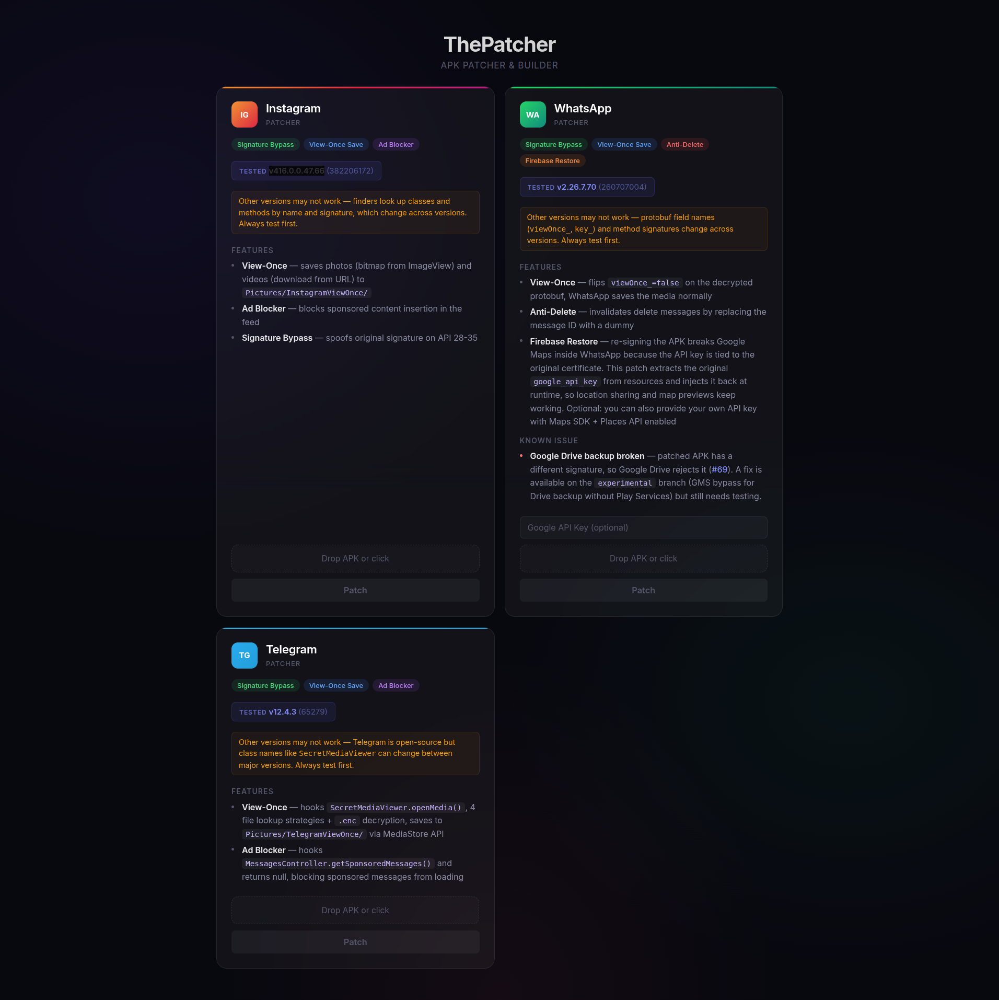

# ThePatcher

APK patching framework for WhatsApp, Telegram, and Instagram. Uses static analysis ([Stitch](https://github.com/Schwartzblat/Stitch)) and runtime method hooking ([YAHFA](https://github.com/PAGalaxyLab/YAHFA)) to modify app behavior without touching the original source code.

## Disclaimer

This project is provided strictly for **educational and research purposes only**. The author(s) do not condone, encourage, or promote the use of this software for any illegal, unethical, or unauthorized activities.

By using this software, you acknowledge and agree that:

- You are solely responsible for ensuring that your use complies with all applicable local, state, national, and international laws and regulations.
- This software is intended to be used in controlled, authorized environments for learning, research, and security testing purposes only.
- The author(s) shall not be held liable for any misuse, damage, or legal consequences resulting from the use of this software.
- Any actions taken using this software are entirely at your own risk.

## Features

### WhatsApp (`whatsapp/`) — *untested*
- Signature bypass
- View-once media saving
- Anti-delete messages

The `experimental` branch has a WIP GMS bypass for Google Drive backups — it does the full auth flow directly without needing Play Services. Also untested.

<details>
<summary>Google API Key (optional)</summary>

You can optionally provide a Google API key to patch the OAuth bypass feature (needed for Google Maps features inside WhatsApp). The key can be entered in the webapp UI when patching WhatsApp.

To get a key:

1. Go to the [Google Cloud Console](https://console.cloud.google.com/)
2. Create a new project or select an existing one
3. Enable **Maps SDK for Android** and **Places API**
4. Go to **Credentials** → **Create Credentials** → **API Key**
5. Restrict the key to your app's package name and SHA-1 fingerprint
</details>

### Telegram (`telegram/`) — *tested*
- Signature bypass
- View-once saving with `.enc` decryption
- Ad blocking for sponsored messages

### Instagram (`instagram/`) — *tested*
- Signature bypass
- View-once photo and video saving
- Ad blocking in the feed

## How to Use

```bash
cd webapp
docker compose up --build
```

Then open [http://localhost:5000](http://localhost:5000), select a patcher, upload the APK, and download the patched version.



## Acknowledgements

This project builds on the work of :
**[Schwartzblat](https://github.com/Schwartzblat):**